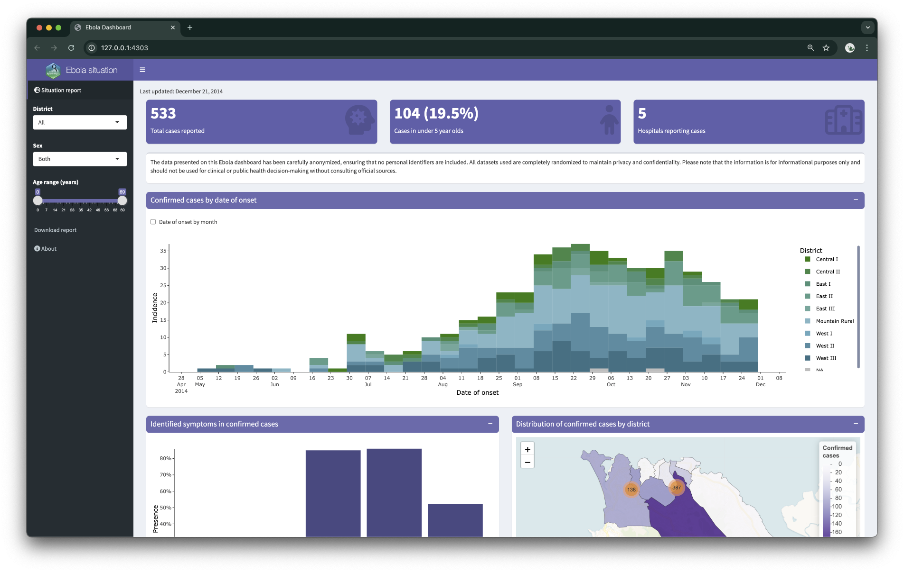

```{r, eval=F, echo=F, include = F}
# Must do in order to render.

pacman::p_load(xaringan)
devtools::install_github("gadenbuie/xaringanExtra")
#devtools::install_github("gadenbuie/countdown")
remotes::install_github("mitchelloharawild/icons")
icons::download_fontawesome()

# Render with xaringan::infinite_moon_reader()
# Slides will appear in viewer, and will update as you edit/save
```


```{r setup, include=FALSE}
knitr::opts_chunk$set(echo = FALSE, 
                      warning = FALSE, 
                      message = FALSE, 
                      fig.retina = 3  ## retina more effective than w/h (according to twitter)
                      # fig.width = 16, 
                      # fig.height = 10
                      )
## I don't know why this is included in the example xaringan slide 
## but is something to do with background images
options(htmltools.dir.version = FALSE)

## install and load necessary packages 
pacman::p_load(
  rio,        # importing data  
  here,       # relative file pathways  
  janitor,    # data cleaning and tables
  lubridate,  # working with dates
  tidyverse,  # data management and visualization
  gtsummary,  # summary tables
  flair,      # coloring text
  kableExtra, # for output tables
  flextable,  # for some tables and styling
  shiny,
  xaringanthemer,  # for styling presentation 
  countdown
)
```


```{r  xaringan-themer, include = FALSE}

## define presentation colours (theme) using {xaringanthemer} package 
## https://pkg.garrickadenbuie.com/xaringanthemer/articles/xaringanthemer.html

## epirhandbook logo colours: 
  ## blue: "#00538c"
  ## green: "#007732"
  ## lighter green: "#48a878"

## see ?style_mono_accent for all the things can customise
style_mono_accent(
  base_color = "#00538c", 
  link_color = "#48a878", 
  # add logo to the title page (bit bigger)
  title_slide_background_image = "../../images/logo.png",
  title_slide_background_position = "95% 95%",
  title_slide_background_size = "25%",
  ## add logo to all following slides
  background_image = "../../images/logo.png", 
  background_size = "10%",
  background_position = "100% 0%"
)
```

```{css, echo=F}
    .remark-slide table{
      border: none
    }
    .remark-slide-table {
      
    }
    tr:first-child {
      border-top: none;
  }
    tr:last-child {
    border-bottom: none;
  }
  
.center2 {
  margin: 0;
  position: absolute;
  top: 50%;
  left: 50%;
}
```


```{css, echo = F}
/* THIS IS A CSS CHUNK - THIS IS A COMMENT */
/* Size of font in code echo. E.g. 10px or 50% */
.remark-code {
  font-size: 70%;
}
/* Size of font in text */
.medium-text {
  font-size: 75%;     
}
/* Size of font in tables */
.small-table table {
  font-size: 6px;     
}
.medium-table table {
  font-size: 8px;     
}
.medium-large-table table {
  font-size: 10px;     
}
```

```{r, echo=F, eval=T}
linelist <- rio::import("../data/surveillance_linelist_clean_20141201.rds")
```


# Today: objectives & schedule

#### In this first module, we aim to help you:-

- Learn the fundamentals of Shiny.
- Understand how to structure a shiny application.
- Become familiar with the concepts and principles of reactive programming.
- Create a simple interactive web application/dashboard using Shiny and implement basic user interface customization.


---
# Our final creation!

```{r, eval = TRUE, echo = FALSE, out.width = "97%", out.height = "100%", fig.align ='centre'}

```


---
# What is a dashboard?

- Information management tool used to organize and display key information, data or metrics interactively.

- Most dashboards are linked to live databases providing real-time data displays i.e. reported cases of coronavirus disease.

--

```{r, eval = TRUE, echo = FALSE, out.width = "70%", fig.align ='center'}
# https://www.ncbi.nlm.nih.gov/pmc/articles/PMC7159018/ [paper published for this dashboard]
# link to the dashboard itself: https://www.arcgis.com/apps/dashboards/bda7594740fd40299423467b48e9ecf6


```

- Commonly used technologies: [Power BI](https://learn.microsoft.com/en-us/power-bi/fundamentals/power-bi-overview), [Tableau](https://www.tableau.com/en-gb), [Excel](https://clickup.com/blog/how-to-create-a-dashboard-in-excel/) etc.


---
# Dashboard use cases

When is a dashboard a requirement?

--

- Data aggregation for comprehensive view when data is scattered across multiple sources for public health communication.

</br>

--

- Real-time monitoring of key data outputs such as visualizations, summary tables and other key metrics such as outbreak detection.

</br>

--

- Simplifies the complexity of presenting data insights to non-technical stakeholders.

</br>

--

- Data curation and query management, such as data quality & completeness.

<!-- </br> -->

<!-- -- -->

<!-- - And many more use/need cases ... -->


---
# What is Shiny?

--
.pull-left[

- An R package for building interactive web applications and dashboards.

</br>

- It's free and open source, inter-operable and runs R code in the back-end. 

</br>

- Transform analyses into responsive web applications without front-end languages like JavaScript.

]


.pull-right[

```{r, out.width ="65%",fig.align ='center', out.height = "60%", echo = F, eval=TRUE}
knitr::include_graphics("images/shiny_logo.png")
```

]


---
# Why use Shiny

--

- Ideal for non-web developers, leveraging R skills to build dynamic web application with ease.

</br>
--

- Integrate with databases & APIs to seamlessly generate **automated** reports, analysis and visualization.

</br>
--

- Combine with front-end languages i.e. JavaScript to create visually appealing and user-friendly interfaces.

</br>
--

- **Consistency & Reproducibility:** Efficiently **package** & **re-use code** for similar databases/data and analyses.


---
# Anatomy of a Shiny app

- Written on a single R script **app.R** inside a directory.

- Has 3 major components comprising purely of R codes.

    - **User interface(UI)** - *Define layout & appearance/aesthetics*
    - **Server function/logic** - *Instructions on how to build objects to display*
    - **A call to launch the app** - *By combining UI and server*
    
    
--
.pull-left[

```{r, out.width ="100%",fig.align ='center', out.height = "100%", echo = F, eval=TRUE}

```

]

--

.pull-right[

```{r, out.width ="150%",fig.align ='center', out.height = "150%", echo = F, eval=TRUE}
knitr::include_graphics("images/simple_shiny.png")
```

]


---
# {shinydashboard}

- {shinydashboard} is an extension of {shiny} for creating dashboards with ease.

- Design professional & interactive dashboards with very minimal code.

--

```{r, out.width ="70%",fig.align ='left', out.height = "60%", echo = F, eval=TRUE}
knitr::include_graphics("images/dashboard_structure.png")
```

- This course will focus on using the [shinydashboard](https://rstudio.github.io/shinydashboard/structure.html) package to design dashboards using R.


---
# {shinydashboard} - Features 

- Unique set of UI components designed for dashboards.

</br>
- Flexible layout options

   - **dashboardHeader()** - *Add logos, titles etc*
   - **dashboardSidebar()** - *App navigation menu and controls.*
   - **dashboardBody()** - *Organize dashboard contents in boxes.*

</br>
- In-build interactive components for displaying key information/metrics (value boxes,info boxes etc)

</br>
- **Styling/theming:** Integrate with custom CSS or use one of the built-in skins


---
# User Interface 

- A dashboard UI layout has three basic parts.

```{r eval = F, echo=T, results = "asis"}
## load packages
pacman::p_load(shiny, shinydashboard)

# user interface(ui)
ui <- dashboardPage(
  dashboardHeader(),   # header contents here
  dashboardSidebar(),  # sidebar and menu/controls
  dashboardBody()      # body contents
)
```

--

.pull-left[
```{r eval = F, echo=T, results = "asis"}
## app.R 
# user interface(ui)
ui <- dashboardPage(    
  dashboardHeader(),
  dashboardSidebar(),
  dashboardBody()
)

# server logic/function
server <- function(input, output, session){ }

# Run the application
shinyApp(ui = ui, server = server)
```
]

--

.pull-right[
```{r, out.width ="100%",fig.align ='center', out.height = "100%", echo = F, eval=TRUE}
knitr::include_graphics("images/blank_app.png")
```
]


---
# UI - dashboardHeader()

- Create & customize a header for a dashboard page.

- Add a title, custom logos and other header menus.

--

.pull-left[
```{r eval = F, echo=T, results = "asis"}
## app.R 
# user interface(ui)
ui <- dashboardPage(    
  dashboardHeader(
    title = "Ebola situation",
    titleWidth = "250px"
  ),
  dashboardSidebar(),
  dashboardBody()
)

# server logic/function
server <- function(input, output, session){ }

# Run the application
shinyApp(ui = ui, server = server)
```
]

--

.pull-right[

```{r, out.width ="100%",fig.align ='center', out.height = "100%", echo = F, eval=TRUE}

```

]

--

- More details on dashboard header elements & customization [here](https://rstudio.github.io/shinydashboard/structure.html#header)


---
# UI - dashboardSidebar()

- The main navigation tool within shinydashboards.

- Organizes and enables switching between displays on the app's body.

- Key components to structure a `dashboardSidebar()`

    - `sidebarMenu()`: Creates the sidebar panel
    - `menuItem()`: Creates sections/tabs in the sidebar for navigating the app.
    - **icon**: argument within menuItem() that enhances visual cues for menus.

--

.pull-left[
```{r eval = F, echo=T, results = "asis"}
## Sidebar content
dashboardSidebar(
        menuItem("Situation report",
                 tabName = "tab_sitrep",
                 icon = icon("globe-europe"))
        )
```
]

--

.pull-right[
```{r, out.width ="100%",fig.align ='center', out.height = "100%", echo = F, eval=TRUE}

```
]

- Further details on dashboardSidebar() [here](https://rstudio.github.io/shinydashboard/structure.html#sidebar)

---
# UI - dashboardBody()

- Main area defining structure and organization of core content.


- Comprises of UI elements like rows, tabs, boxes, inputs etc.


```{r eval = F, echo=T, results = "asis"}
## app.R 
dashboardBody(
      tabItems(
        tabItem(tabName = "tab_sitrep",
                fluidRow(
                  box(title = "Confirmed cases by date of onset",
                      plotOutput("surv_epicurve"))
                  ))))
```

--

- Key features:-

    - `tabItems` - *Display/output contents in multiple tabs.*
    - `fluidRow()` - *Creates responsive layout & Organizes contents in rows.*
    - `box()` - *Contains Shiny outputs i.e. plots, tables and interactive elements `plotOutput()`, `tableOutput()` etc.*

- More details on dashboard body layout & customization [here](https://rstudio.github.io/shinydashboard/structure.html#body)


---
# UI Elements

- Shiny provides UI elements and widgets for defining input and output functionalists of the app.

</br>
- Three broad categories of UI elements:-

    - Layouts: `fluidRow()`, `fluidPage()`, `column()`, `box()` etc
    - Input widgets: `selectInput()`, `radioButtons()`, `fileInput()` etc.
    - Output widgets: `plotOutput()`, `tableOutput()`, `textOutput()` etc.

- Input widgets collects/captures values/inputs from the user i.e. texts, numeric values, files etc.


</br>
- Output widgets displays objects generated i.e plots, tables, text etc.


</br>
- **NB:** UI widget corresponds to an input or output function on the server logic.


---
# UI Elements - Input widgets

- Essential for controlling the app's behavior, collect users' input, making selections etc.


- General syntax: **＿**Input(), where **＿** is the input type for instance **select**Input for creating single-select drop down selection list.

--

.pull-left[
```{r eval = F, echo=T, results = "asis"}
  # District drop down syntax
selectInput(inputId  = "select_district",
            label = "District",
            choices = c("All", "Central II", "Mountain Rural", "East II", ".."),
            selected = "All")
```
]

--

.pull-right[
```{r, out.width ="100%",fig.align ='center', out.height = "40%", echo = F, eval=TRUE}

```
]

--

- ALL **inputId**s **MUST** be unique in your app. They are used to access values provided by the user in the server logic.


- More about UI input widgets [here](https://shiny.posit.co/r/getstarted/build-an-app/reactive-flow/ui-inputs.html),
alongside examples found [here](https://shiny.posit.co/r/gallery/widgets/widget-gallery/)


---
# UI Elements - Output widgets

- Responsible for displaying dynamic content such as plots, tables and any calculation from server-side on the UI.


- General syntax: **＿**Output(), where **＿** is the output type to be displayed i.e **plot**Output() and *dataTable*Output() to display plots and tables respectively.

--

.pull-left[
```{r eval = F, echo=T, results = "asis"}
fluidRow(
  # Full page box for plotly output
  box(width = 12,
    plotOutput(outputId = "surv_epicurve")),
  
  # Full page box for data table output
  box(width = 12,
    dataTableOutput(outputId = "surv_datatable"))
  )
)
```
]

--

.pull-right[
```{r, out.width ="100%",fig.align ='center', out.height = "100%", echo = F, eval=TRUE}

```

]

--

- As with inputId's, ALL **outputId**'s **MUST** be unique in your shiny app.


</br>
- More on UI output widgets [here](https://shiny.posit.co/r/getstarted/build-an-app/reactive-flow/ui-outputs.html)


---
# Server-side

-	This is where the back-end logic of a shiny app is implemented. Input from the UI are processed and dynamic outputs are created.

-	Basically telling Shiny how to build objects to be displayed in the UI, using regular R code.


```{r eval = F, echo=T, results = "asis"}
# server logic/function
server <- function(input, output, session){ 
  
  # All server logic/instructions go here
  # Including R code
  }
```

- A large R function, with 3 arguments and comprises of smaller tasks/sub-tasks for the app to perform.

    - `input` - Makes it possible to access user-provided values from UI in server side.
    
    - `output` - Represent R objects created to be displayed in shiny UI.


---
# Integrating UI and server

--

```{r, eval = TRUE, echo = FALSE, out.width = "90%", fig.align ='left'}

```

.footnote[
[Image sourced from Intro to Data Science ](https://bookdown.org/hneth/i2ds/shiny.html)

]

---
# Integrating UI and server

- **render** functions are used to create outputs to display on the UI.

- They take input or data & generate dynamic outputs. Each render function returns a specific type of output e.g., table, plot etc.

- The endpoints produced in the server are passed to the UI using **outputId**'s.

- General syntax: render**＿**, where **＿** is the output type, i.e. render**Plot()** for outputing plots, render**Table()** to output tables etc.

--

```{r eval = F, echo=T, results = "asis"}
# server logic/function
server <- function(input, output, session){ 
  
  # generate a plot for the UI
  output$plotId <- renderPlot({
    
    # R code to produce a histogram
    ggplot(data = surv, aes(x = date, fill = district)) +
      geom_histogram()
  })
}
```

--

- **output$plotId** passes back the object to be displayed in the UI.


---
# Integrating UI and server


.pull-left[

- Sidebar menu

```{r eval = F, echo=T, results = "asis"}
## Sidebar content
dashboardSidebar(
        menuItem("Situation report",
                 tabName = "tab_sitrep",
                 icon = icon("globe-europe"))
        )
```

- Dashboard body

```{r eval = F, echo=T, results = "asis"}
dashboardBody(
      tabItems(
        tabItem(tabName = "tab_sitrep",
                fluidRow(
                  box(plotOutput(outputId = "surv_epicurve"))
                  ))))
```

]

--

.pull-right[

- Inside server side

```{r eval = F, echo=T, results = "asis"}
  output$surv_epicurve <- renderPlot({
    # R code to produce a histogram 'outputId' in UI
    ggplot(data = surv, aes(x = date, fill = district)) +
      geom_histogram()
  })
```

- UI display

```{r, out.width ="100%",fig.align ='center', out.height = "100%", echo = F, eval=TRUE}

```

]

--

- NOTE: **tabName** in sidebar menu and dashboard body; UI plot's **outputId** as used in server logic.

---
# Intro. to reactivity

- Programming concept where UI outputs (plots, tables etc) auto-update as user inputs are changed.

-	ALL **render＿** functions in the server create a reactive context, thus reactive outputs.

- Reactive values such as UI inputs MUST be accessed inside reactive context.

--

```{r eval = F, echo=T, results = "asis"}
# UI input to select district
selectInput(inputId  = "select_district",
            label = "District",
            choices = c("All", "Central II", "Mountain Rural", "East II"),
            selected = "All")
```

```{r eval = F, echo=T, results = "asis"}
 # server side to access value of district drop down selected
  output$surv_epicurve <- renderPlot({
    surv %>%  
      filter(district == input$select_district) %>%
      ggplot(aes(x = date, fill = district)) +
      geom_histogram()
  })
```

- Reactivity is the backbone of shiny, read more [here](https://mastering-shiny.org/basic-reactivity.html)


---
# How reactivity works

- The plot depends on the value of **input$select_district** supplied by user selection.
--

```{r, out.width ="70%",fig.align ='left', out.height = "50%", echo = F, eval=TRUE}
knitr::include_graphics("images/reactive_0.png")
```

--

```{r, out.width ="70%",fig.align ='left', out.height = "50%", echo = F, eval=TRUE}

```

--

```{r, out.width ="70%",fig.align ='left', out.height = "50%", echo = F, eval=TRUE}

```


---
# UI page layouts

- The UI page can be taken as a region comprising 12 columns of equal width & unlimited number of rows.

- Placing a box or output in the region, you specify how many of the 12 columns you want it to utilize using **width** argument

.pull-left[
```{r, out.width ="78%",fig.align ='right', out.height = "50%", echo = F, eval=TRUE}

```
  
]


.pull-right[
    

  ]
 
 
- Three types of layouts:-

   - Row-based layout
   - Column-based layout
   - Mixing row and column layout

- More on layouts [here](https://mastering-shiny.org/action-layout.html) and this [article](https://rstudio.github.io/shinydashboard/structure.html#layouts)


---
# Row-based layout

- **box()**es goes in a row created by **fluidrow()** with width specified by **with=** argument.


.pull-left[
```{r eval = F, echo=T, results = "asis"}
  dashboardBody(
    fluidRow(
      box(width = 4,  # row 1 column 1 for inputs
               sliderInput("num", "Number of Random Points:", min = 10, max = 100, value = 50),
               selectInput("color", "Choose Point Color:", 
                           choices = c("Red", "Blue", "Green"))
      ),
      box(width = 8,  # row 1 column 2 for outputs
               plotOutput("scatterPlot")
      )
    )
  )
```
 
]

--

.pull-right[
    
```{r, out.width ="100%",fig.align ='center', out.height = "100%", echo = F, eval=TRUE}

```

]

</br>

- In row-based layouts, tops of boxes will align but bottoms might not based on content to display.


---
# Column-based layout

- Create **column()**s of desired **with=** and place outputs/items within those columns.


.pull-left[
```{r eval = F, echo=T, results = "asis"}
  dashboardBody(
    fluidRow(
      column(width = 4,  # Left column for inputs
               title = "Inputs",
               sliderInput("num", "Number of Random Points:", min = 10, max = 100, value = 50),
               selectInput("color", "Choose Point Color:", 
                           choices = c("Red", "Blue", "Green"))
      ),
      column(width = 8,  # Right column for outputs
               plotOutput("scatterPlot")
      )
    )
  )
)
```
 
]

--

.pull-right[
    
```{r, out.width ="100%",fig.align ='center', out.height = "100%", echo = F, eval=TRUE}

```

]

</br>

- First column contains inputs while second column has the outputs.


---
# Summary

```{r, out.width ="88%",fig.align ='center', out.height = "50%", echo = F, eval=TRUE}

```


---
class: inverse, center, middle


## Time for a live demo 


```{r, eval = FALSE, echo = FALSE, out.width = "75%"}
# adding xfun::relative_path() creates a dynamic file path between the Rmd location and the here() path.
# It dynamically creates the ../../etc filepath.

knitr::include_graphics(xfun::relative_path(here::here("images", "template", "Safety Match - COVID artwork.png")
```


---
class: inverse, center, middle


## Exercises 
### Time to try out some shiny coding!


```{r, eval = FALSE, echo = FALSE, out.width = "75%"}
# adding xfun::relative_path() creates a dynamic file path between the Rmd location and the here() path.
# It dynamically creates the ../../etc filepath.

knitr::include_graphics(xfun::relative_path(here::here("images", "template", "Safety Match - COVID artwork.png")
```

