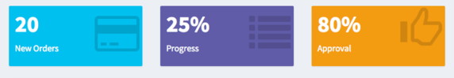
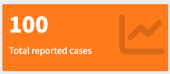

```{r, eval=F, echo=F, include = F}
# Must do in order to render.

pacman::p_load(xaringan)
devtools::install_github("gadenbuie/xaringanExtra")
devtools::install_github("gadenbuie/countdown")
remotes::install_github("mitchelloharawild/icons")
icons::download_fontawesome()

# Render with xaringan::infinite_moon_reader()
# Slides will appear in viewer, and will update as you edit/save
```


```{r setup, include=FALSE}
knitr::opts_chunk$set(echo = FALSE, 
                      warning = FALSE, 
                      message = FALSE, 
                      fig.retina = 3  ## retina more effective than w/h (according to twitter)
                      # fig.width = 16, 
                      # fig.height = 10
                      )
## I don't know why this is included in the example xaringan slide 
## but is something to do with background images
options(htmltools.dir.version = FALSE)

## install and load necessary packages 
pacman::p_load(
  rio,        # importing data  
  here,       # relative file pathways  
  janitor,    # data cleaning and tables
  lubridate,  # working with dates
  tidyverse,  # data management and visualization
  gtsummary,  # summary tables
  flair,      # coloring text
  kableExtra, # for output tables
  flextable,  # for some tables and styling
  xaringanthemer,  # for styling presentation
  xaringanExtra, # for nice panel sets
  countdown
)

# need to use panelset
xaringanExtra::use_panelset()
```


```{r  xaringan-themer, include = FALSE}

## define presentation colours (theme) using {xaringanthemer} package 
## https://pkg.garrickadenbuie.com/xaringanthemer/articles/xaringanthemer.html

## epirhandbook logo colours: 
  ## blue: "#00538c"
  ## green: "#007732"
  ## lighter green: "#48a878"

## see ?style_mono_accent for all the things can customise
## see ?style_mono_accent for all the things can customise
style_mono_accent(
  base_color = "#00538c", 
  link_color = "#48a878", 
  # add logo to the title page (bit bigger)
  title_slide_background_image = "../../images/logo.png",
  title_slide_background_position = "95% 95%",
  title_slide_background_size = "25%",
  ## add logo to all following slides
  background_image = "../../images/logo.png", 
  background_size = "10%",
  background_position = "100% 0%"
)
```

```{css, echo=F}
    .remark-slide table{
      border: none
    }
    .remark-slide-table {
      
    }
    tr:first-child {
      border-top: none;
  }
    tr:last-child {
    border-bottom: none;
  }
  
.center2 {
  margin: 0;
  position: absolute;
  top: 50%;
  left: 50%;
}
```


```{css, echo = F}
/* THIS IS A CSS CHUNK - THIS IS A COMMENT */
/* Size of font in code echo. E.g. 10px or 50% */
.remark-code {
  font-size: 70%;
}
/* Size of font in text */
.medium-text {
  font-size: 75%;     
}
/* Size of font in tables */
.small-table table {
  font-size: 6px;     
}
.medium-table table {
  font-size: 8px;     
}
.medium-large-table table {
  font-size: 10px;     
}
```

```{r, echo=F, eval=T}
linelist <- rio::import("../data/surveillance_linelist_clean_20141201.rds")
```

# Our goal! 

```{r, eval = TRUE, echo = FALSE, out.width = "95%"}
# Using here() alone won't work because Rmd folder becomes the rendering root.
# adding xfun::relative_path() creates a dynamic file path between the Rmd location and the here() path. # It dynamically creates the ../../etc filepath.


```

??? 
Get them excited about the final dashboard we will build together! 

---
# Module 2 goals and overview 
**Objective:** To deepen your understanding of Shiny by exploring advanced features and techniques for creating interactive and dynamic dashboards


**Today we will cover: **

**Part 1**
- Advanced user interface (UI) components and widgets
  - Value boxes, multiple filters, pop-ups, download button
- Reactive filtering
- Interactive maps 

**Part 2**
- Advanced customization of your dashboard
  - Logos, colors, themes
  - CSS
  

???

---
class: inverse, center, middle
# Part 1: Advanced UI

---
# Advanced UI components

There are many options available for Shiny widgets and components.

<iframe src="https://gallery.shinyapps.io/081-widgets-gallery/" width="100%" height="300px"></iframe>

.footnote[
Take a look at the [Widget gallery](https://shiny.posit.co/r/gallery/widgets/widget-gallery/)
]

???
Briefly scroll through the options, click on the link and take them through one example.

---
# Advanced UI components
Many of the `{shinydashboard}` UI components have a `status` or `color` argument where you can modify its appearance.

--
### Statuses
```{r, eval = TRUE, echo = FALSE, out.width = "70%"}
# Using here() alone won't work because Rmd folder becomes the rendering root.
# adding xfun::relative_path() creates a dynamic file path between the Rmd location and the here() path. # It dynamically creates the ../../etc filepath.


```

--
### Colors

```{r, eval = TRUE, echo = FALSE, out.width = "65%"}
# Using here() alone won't work because Rmd folder becomes the rendering root.
# adding xfun::relative_path() creates a dynamic file path between the Rmd location and the here() path. # It dynamically creates the ../../etc filepath.

knitr::include_graphics("images/cols.png")
```

---
# Advanced UI components

Some UI components can be static or dynamic

### Static 
- include them in the UI 

### Dynamic
- include them in the UI **and** render them in the server 

---
# Value boxes

Value boxes can display important information and summary statistics such as: 

- Total number of cases
- Percentage of positive cases
- Important dates

--

You can add different icons from the [Font Awesome](https://fontawesome.com/v5/search?o=r&m=free) to the background of your box. 

--

```{r, eval = TRUE, echo = FALSE, out.width = "100%"}
# Using here() alone won't work because Rmd folder becomes the rendering root.
# adding xfun::relative_path() creates a dynamic file path between the Rmd location and the here() path. # It dynamically creates the ../../etc filepath.


```

.footnote[
More info on valueBoxes can be found [here](https://rstudio.github.io/shinydashboard/structure.html#valuebox)
]

???
After going through the brief list, ask them if they can think of any other examples of key data they may want to display in their dashboard? Briefly mention the icon options from the Font Awesome library

---
# Static Value boxes

### In the UI:
```{r echo=T, eval=F}
valueBox(value = 100, # a static value to be displayed
         subtitle = "Total reported cases", # the text to be displayed
         icon = icon("chart-line"), # the icon from Font Awesome
         color = "orange", # the color of the box
         width = 6) # the width of the box in 
```

--

```{r, eval = TRUE, echo = FALSE, out.width = "50%"}
# Using here() alone won't work because Rmd folder becomes the rendering root.
# adding xfun::relative_path() creates a dynamic file path between the Rmd location and the here() path. # It dynamically creates the ../../etc filepath.


```

**`r fontawesome::fa("lightbulb")` Tip: ** the valid colors you can use for the boxes are: red, yellow, aqua, blue, light-blue, green, navy, teal, olive, lime, orange, fuchsia, purple, maroon, black.

???
Briefly mention that they can choose different colors
---
# Dynamic Value boxes

### In the UI:
```{r echo=T, eval=F}
valueBoxOutput(outputId = "dynamic_box") 
```

--

### In the server: 
```{r echo=T, eval=F}
output$dynamic_box <- renderValueBox{(
  total_cases <- nrow(surv) # get the number of cases in our line list 
  
  valueBox(value = total_cases, # our dynamic value
           subtitle = "Total reported cases", # the text to be displayed
           icon = icon("chart-line"), # the icon from Font Awesome
           color = "orange", # the color of the box
           width = 6) # the width of the box in 
)}
```

???
Introduce the new functions valueBoxOutput(), renderValueBox() and the importance of the box name "dynamic_box" as well as the reactive box value "total_cases".

---
# Pop-ups
You might want to include useful pop-up messages, or even error messages in your app. These can be reactive to certain 'trigger events'. 

.panelset.sideways[
  .panel[.panel-name[Notifications]
  Notifications appear at the bottom right corner, appear for 5 seconds and fade away
  
```{r, eval = TRUE, echo = FALSE, out.width = "50%"}
# Using here() alone won't work because Rmd folder becomes the rendering root.
# adding xfun::relative_path() creates a dynamic file path between the Rmd location and the here() path. # It dynamically creates the ../../etc filepath.


```
         
**`r fontawesome::fa("lightbulb")` Tip: ** The default notification color is grey, but use other colors by changing the `type` argument
         
More information [here](https://shiny.posit.co/r/articles/build/notifications/)
]

.panel[.panel-name[Modal dialogs]
Modal dialogs appear as a pop-up box and the user must click to dismiss.

<iframe src="https://gallery.shinyapps.io/114-modal-dialog/" top="-250px" width="70%" height="200px"></iframe>

More information [here](https://shiny.posit.co/r/articles/build/modal-dialogs/)
]

- the HTML for the modal dialog
- a call to `showModal()`
- an observer, so the modal dialog appears in response to a trigger event
]

---
# Download button

The download button is a special Shiny widget that allows content from the Shiny app to be downloaded by the user.

### In the UI:
```{r echo=T, eval=F}
downloadButton(outputId = "download_data", # the outputID
               label = "Download data", # label to be displayed
               icon = icon("download")) # icon from Font Awesome
```

--
### In the server: 
```{r echo=T, eval=F}
output$download_data <- downloadHandler(
  filename = function(){
    "ebola_linelist.csv"
  }, # the filename string
  content = function(file){
    write_csv(surv, path = file) # the function to write the content to file
  }
)
```

???
Make sure they note the function calls inside downloadHandler()

---
# Reactive filtering

As we increase the complexity of our dashboard, we want to make use of multiple filters. An elegant way is by using **reactive filtering** to increase app performance if our dataset is large. 

```{r echo=T, eval=F}
get_surv_data <- function() {
    surv_filtered <- surv # Create a copy of the all 'surv' data
    
    # If a district is selected, then filter it.
    if (input$select_district != "All") {
      surv_filtered <- surv_filtered %>% 
        filter(district == input$select_district)
    }
    
    # If a gender is selected, then filter it.
    if (input$select_gender != "both") {
      surv_filtered <- surv_filtered %>% 
        filter(gender == input$select_gender)
    }
    
    return(surv_filtered)
  }
```


---
# Interactive maps with leaflet

The `{leaflet}` package can be used within your Shiny app to create interactive and customizable maps. The syntax is different because it is an R wrapper for the leaflet JavaScript library. 

<!-- <iframe src="https://vac-lshtm.shinyapps.io/ncov_tracker/" top="-250px" width="100%" height="350px"></iframe> -->

<iframe src="https://gallery.shinyapps.io/063-superzip-example/" top="-250px" width="100%" height="300px"></iframe>

.footnote[
More info on leaflet can be found [here](https://rstudio.github.io/leaflet/articles/shiny.html)
]

???
VERY briefly introduce leaflet but mention that we will not get into maps in too much detail, rather we will focus on how to incorporate its reactivity within a Shiny app. With the example map show the ability to zoom in/out and to click on yellow points to show the text. 

---
# Interactive maps with leaflet

### In the UI:
```{r echo=T, eval=F}
leafletOutput("map") 
```

--

### In the server: 
```{r echo=T, eval=F}
output$map <- renderLeaflet{(
  leaflet(data = surv_map_data) %>% # data for plotting
    addProviderTiles() %>% # add the base map
    addPolygons() %>% # add shape files
    addLegend() # add a legend 
)}
```

???
Make sure to note that you "build" on the leaflet map using the pipe %>% 
Mention that this is a VERY brief intro to leaflet, and they will explore the customization more in the exercise. although remind them that the point of this course is not to teach maps

---
class: inverse, center, middle
# Demo Part I

---
class: inverse, center, middle
# Exercises Part I 

---
class: inverse, center, middle
# Part 2: Advanced customization

---
# Using HTML and CSS

'Under the hood' your Shiny app is generating HTML, but the `{shiny}` R package is designed so that you don't need to know HTML, or CSS for that matter. 

--
- **HTML** (HyperText Markup Language): standard language to **create** web pages using specific elements (headings, paragraphs, images, etc)  
- **CSS** (Cascading Style Sheets): code that **styles** web content by controlling specific design elements (fonts, colors, spacing, etc)

--

HTML and CSS are beyond the scope of this course, but we will show you some tips and tricks! 

.footnote[
More details on how to use custom [CSS](https://shiny.posit.co/r/articles/build/css/) and [HTML](https://shiny.posit.co/r/articles/build/html-tags/) in your app
]

---
# Customizing your theme

There are a number of themes within the `{shinydashboard}` package. This avoids the need to modify the CSS yourself. 

--

You can change the appearance by modifying the 'skin' color argument. 
```{r echo=T, eval=F}
dashboardPage(skin = "purple")
```

The available colors are: blue *(default)*, black, purple, green, red, yellow. More information on available themes can be found [here.](https://rstudio.github.io/shinydashboard/appearance.html). 

There is also the [`{shinydashboardPlus}` package](https://rinterface.github.io/shinydashboardPlus/articles/shinydashboardPlus.html) that has extra features including customization and layouts. Here is an [example](https://adminlte.io/themes/AdminLTE/index2.html).

.footnote[
*If you are building a Shiny app without the {shinydashboard} package, you can use the [`{shinythemes}`](https://rstudio.github.io/shinythemes/) package to customize.*
]
---
# Add a logo
We can use HTML to add a logo to our dashboard header, as part of the `title` argument. 

The HTML tag that we need to use is `` to embed an image. It requires a `src` attribute to specify the path to the image and we can define styling elements such as the padding around the image or the width/height of the image. 

--
```{r echo=T, eval=F}
dashboardPage(
  header = dashboardHeader(
    title = HTML(' 
                 Situation report dashboard') 
  )
)
```

.footnote[
[More resources on HTML can be found [here](https://shiny.posit.co/r/articles/build/html-tags/)
]

???
Mention that we will not cover HTML in detail in this course, but provide some tricks that they can implement in their own dashboard apps

---
# Advanced app structure
The more complex our app gets, the more it will benefit from 'modularization'. 

--

.pull-left[
Our app structure before:
```{r echo=T, eval=F}
ui <- fluidPage(
  dashboardPage(
    # some code
  ))

server <- function(input, output, session){
  # some code
} 

# run our app
shinyApp(ui = ui, 
         server = server) 
```
]

--
.pull-right[
A modular app structure:

- **Option 1**: *Separate files*
```{r echo=T, eval=F}
~/myModularApp
|-- ui.R
|-- server.R
```

To run: `runApp("myModularApp")`

- **Option 2**: *Modules/Namespaces*:
A module is a set of UI and server functions (constructed as a namespace)

See [Mastering Shiny](https://mastering-shiny.org/scaling-modules.html#scaling-modules) for more details
]

???
Do NOT spend much time on modules/NS - explain that it is like modularizing many simple shiny apps and then chaining them together. You can briefly mention that it is a useful approach for more complex apps because it makes debugging and scaling easier and allows for easier collaborative dev

---
# Sharing and deploying your app

There are several options for sharing your app both static and 'live'.

- Share the code and have users build locally (eg static .zip file)
  - *Requires end-users to maintain an R installation!*
- Publish to a server
  - *shinyapps.io*: easiest place to publish shiny apps, some free but limited licenses

**You will be deploying your first app by the end of this course!**

---
class: inverse, center, middle
# Demo Part 2

---
class: inverse, center, middle
# Exercises part 2
