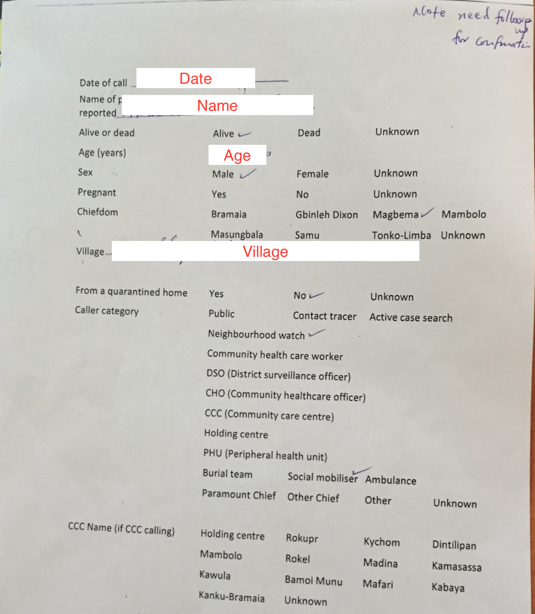
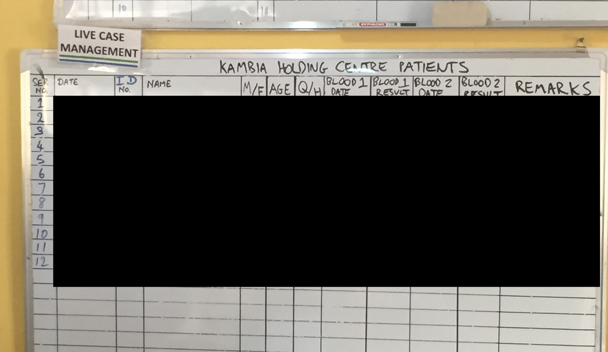

```{r, eval=F, echo=F, include = F}
# Must do in order to render.

pacman::p_load(xaringan)
devtools::install_github("gadenbuie/xaringanExtra")
devtools::install_github("gadenbuie/countdown")
remotes::install_github("mitchelloharawild/icons")
icons::download_fontawesome()

# Render with xaringan::infinite_moon_reader()
# Slides will appear in viewer, and will update as you edit/save
```


```{r setup, include=FALSE}
knitr::opts_chunk$set(echo = FALSE, 
                      warning = FALSE, 
                      message = FALSE, 
                      fig.retina = 3  ## retina more effective than w/h (according to twitter)
                      # fig.width = 16, 
                      # fig.height = 10
                      )
## I dont know why this is included in the example xaringan slide 
## but is something to do with background images
options(htmltools.dir.version = FALSE)

## install and load necessary packages 
pacman::p_load(
  rio,        # importing data  
  here,       # relative file pathways  
  janitor,    # data cleaning and tables
  lubridate,  # working with dates
  tidyverse,  # data management and visualization
  gtsummary,  # summary tables
  flair,      # coloring text
  kableExtra, # for output tables
  flextable,  # for some tables and styling
  xaringanthemer,  # for styling presentation 
  countdown
)

```


```{r  xaringan-themer, include = FALSE}

## define presentation colours (theme) using {xaringanthemer} package 
## https://pkg.garrickadenbuie.com/xaringanthemer/articles/xaringanthemer.html

## epirhandbook logo colours: 
  ## blue: "#00538c"
  ## green: "#007732"
  ## lighter green: "#48a878"

## see ?style_mono_accent for all the things can customise
style_mono_accent(
  base_color = "#00538c", 
  link_color = "#48a878", 
  # add logo to the title page (bit bigger)
  title_slide_background_image = "../../images/logo.png",
  title_slide_background_position = "95% 95%",
  title_slide_background_size = "25%",
  ## add logo to all following slides
  background_image = "../../images/logo.png", 
  background_size = "10%",
  background_position = "100% 0%"
)
```

```{css, echo=F}
    .remark-slide table{
      border: none
    }
    .remark-slide-table {
      
    }
    tr:first-child {
      border-top: none;
  }
    tr:last-child {
    border-bottom: none;
  }
  
.center2 {
  margin: 0;
  position: absolute;
  top: 50%;
  left: 50%;
}
```


```{css, echo = F}
/* THIS IS A CSS CHUNK - THIS IS A COMMENT */
/* Size of font in code echo. E.g. 10px or 50% */
.remark-code {
  font-size: 70%;
}
/* Size of font in text */
.medium-text {
  font-size: 75%;     
}
/* Size of font in tables */
.small-table table {
  font-size: 6px;     
}
.medium-table table {
  font-size: 8px;     
}
.medium-large-table table {
  font-size: 10px;     
}
```


# Thank you for joining us  

**Thank you for your service** *to your community in these busy times for public health. We are glad that you are taking the time to learn R with us.*  

- Brief introductions from the instructors  

---

# Working with raw data

In the last module you were given clean data and then asked to analyze it.

This module will focus on how you can obtain that clean data **from raw data**, and potential issues that can arise.

---

# Dates

If you only take one thing from this course: **Understanding what your dates mean is the single most important thing for time series analysis and writing your status reports**.

What does your date mean? 

- Date of infection?
- Date of symptom start?
- Date of test taken? 
- Date of received result?
- Date of admission to hospital?
- Date that you (the epi) received the result?

**Be careful with date formats!** 

(eg. MM-DD-YYYY (US/Canada), DD-MM-YYYY, YYYY-MM-DD, etc.)

.footnote[Make sure that you are explicit with your definitions in your status reports.]

---

# Linelist

A linelist is a dataset where one row (line of data) represents a case, and each column represents a variable containing metadata.

This is how it typically looks on your computer.

```{r, eval = TRUE, echo = FALSE}
d <- data.frame(
  date_of_symptoms = c(as.Date("2020-03-01"), as.Date("2020-03-01"), as.Date("2020-03-01")),
  date_of_test_taken = c(as.Date("2020-03-03"), as.Date("2020-03-02"), as.Date("2020-03-03")),
  date_of_hospital_admission = c("2020-03-03", "NA", "NA"), # just to show NA's on the flextable on the slide
  age = c(45, 23, 21),
  sex = c("Male", "Male", "Female")
)

d %>% 
  qflextable() %>% 
  align(part = "all", align="center")
```

.footnote[Note how the dates are explicit.]

---

# Acute watery diarrhea (AWD)

.pull-left[
This was an oral rehydration site where visitors with AWD could receive oral rehydration salts.

Visitors were recorded as:

- Male <5 years
- Male 5+ years
- Female <5 years
- Female 5+ years

**What does the date mean?**
]

.pull-right[
```{r, eval = TRUE, echo = FALSE}
# Using here() alone won't work because Rmd folder becomes the rendering root.
# adding xfun::relative_path() creates a dynamic file path between the Rmd location and the here() path. It dynamically creates the ../../etc filepath.

knitr::include_graphics(("../images/awd_cbs.JPG"))
```
]

.footnote[**Be careful with date formats!**<br>(eg. MM-DD-YYYY (US/Canada), DD-MM-YYYY, YYYY-MM-DD, etc.)]

---

# Ebola

.pull-left[

This was a 911 call-center for suspected Ebola cases.

Lots of details were recorded about the caller.

**What does the date mean?**

.footnote[Note that the form explicitly says "Date of **call**".]
]

.pull-right[
```{r, eval = TRUE, echo = FALSE}
# Using here() alone won't work because Rmd folder becomes the rendering root.
# adding xfun::relative_path() creates a dynamic file path between the Rmd location and the here() path. It dynamically creates the ../../etc filepath.


```
]

---

# Ebola 

.pull-left[
This was a holding center, where people were waiting for their negative test results (to go home), or positive test results (to get treatment). 

- Blood test 1 date
- Blood test 1 result
- Blood test 2 date
- Blood test 2 result

**What does the date mean?**

.footnote[Note that the whiteboard explicitly says "**Blood test** date".]
]

.pull-right[
```{r, eval = TRUE, echo = FALSE}
# Using here() alone won't work because Rmd folder becomes the rendering root.
# adding xfun::relative_path() creates a dynamic file path between the Rmd location and the here() path. It dynamically creates the ../../etc filepath.


```
]

---

# Registration/reporting delay

Registration delay is the waiting time between when an event occurs and it is registered in the system.

Reporting delay is the waiting time between the data being registered in the system and you getting the data.

<div style="font-size: 80%;">
```{r}
kable(
  data.frame(
    Step = 1:7,
    Event = c(
      "A person is infected. [**The epidemiological event**]",
      "The person shows symptoms. [**Date of symptoms**]",
      "The person visits the doctor. [**Date of consultation**]",
      "The person is sent to a phlebotomist to have their blood taken. [**Date of sample**]",
      "The blood is sent to a lab.",
      "The lab sends the results to the doctor.",
      "The epidemiologist obtains the data from the doctor. [**You are here**]"
    ),
    `Type of Delay` = c(
      "Start of timeline",
      "Part of registration delay",
      "Part of registration delay",
      "Part of registration delay",
      "Part of registration delay",
      "Part of registration delay",
      "Reporting delay"
    )
  ),
  format = "html"
) |> 
   kable_styling(font_size = 12) 
```

---
# Day-of-week effect

.pull-left[
If day-of-week effect exists, it means that Monday is not comparable to Tuesday.

Therefore you must use **whole weeks**, so that you create comparable units (week 1 vs week 2).
]

.pull-right[
```{r, echo=F, eval=T}
set.seed(123)  # For reproducibility

# Specify the Poisson mean for each day (1=Monday, 7=Sunday)
means <- c(15, 10, 10, 10, 5, 3, 1)

# Generate the days of the week sequence
days_of_week <- rep(1:7, length.out = 500)

# Simulate data using rpois for each day based on the specified means
simulated_data <- data.frame(
  day = days_of_week,
  counts = rpois(500, lambda = means[days_of_week])
)

q <- ggplot(simulated_data, aes(x = as.character(day), y = counts))
q <- q + geom_boxplot()
q <- q + labs(title="Obvious day of week effect")
q <- q + labs(x="Day of week (1 = Monday, 7 = Sunday)")
q <- q + labs(y="Number of cases")
q
```
]


---

# Skeleton

**This is a very important concept**

.pull-left[
A skeleton is a `dataframe` that has been expanded to include all desired dates (in other situations, it could contain all combinations of isoweeks/locations/sexes/etc).

Once you have created the skeleton, you then "attach the flesh to the bones" (i.e. join in all the real data).

This allows us to ensure that all of the dates/locations/sexes exist in the clean dataset, even when there are zero registered cases.
]

.pull-right[
**Attach the flesh to these bones!**
```{r, echo=F, eval=T}
d <- data.frame(date=seq.Date(as.Date("2001-01-01"), as.Date("2001-01-10"), 1))
print(d)
```
]

---

# Exercise time

The best way to learn is to try it yourself!

**As you go along, please remember to type into the chat if you have any questions.**

---

# Wrap up

Where do you go from here?

---

# Location codes

- Unique location codes are fantastic, as they eliminate confusion.

- They don't always exist, and sometimes you might need to generate your own ad-hoc location codes based off the location names.

- Remember that location names typically aren't unique, and to obtain a unique name you might need to combine it with the municipality/county/region name.

    - "Perth/South_Africa"
    - "Perth/Australia"
    - "Perth/Scotland"

---

# Things to be aware of

- **Redistricting** is not fun, but ignoring it won't make it go away. Be aware!
- Be aware of how **registration delay** is affecting your results!
- If you're working in an international team, be aware of MM-DD-YYYY versus DD-MM-YYYY confusion.

---

# Structural data

- Centralized structural data ensures standardization and consistency across teams, projects, and analyses. This boosts efficiency and makes your deliverables appear more professional.

- Lowest hanging fruit is a dataset that contains details about all the geographical areas in your area of responsibility.

- Other options can be population data or cleaned maps.

- Make sure you test it out for three months before you distribute it widely.


