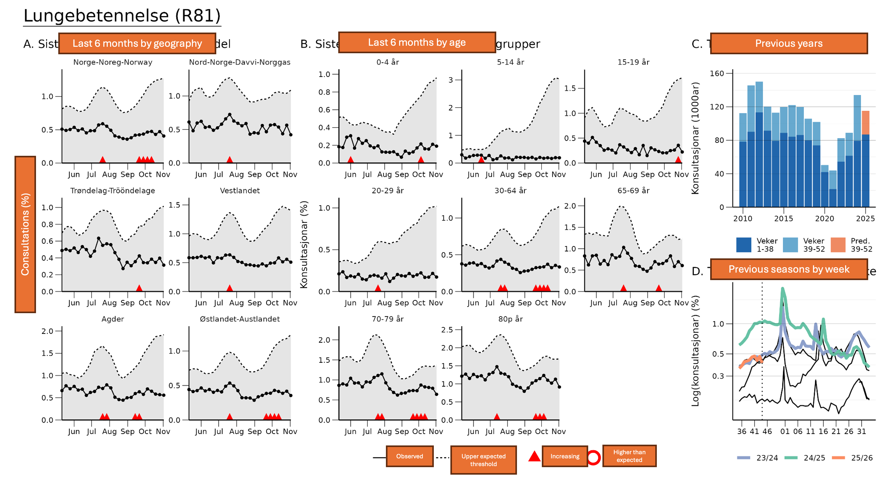
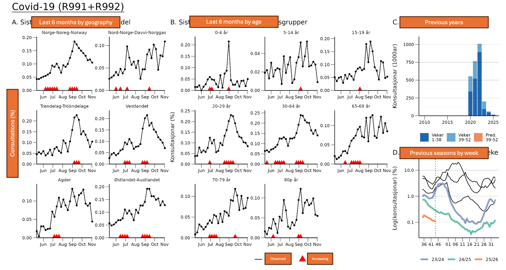
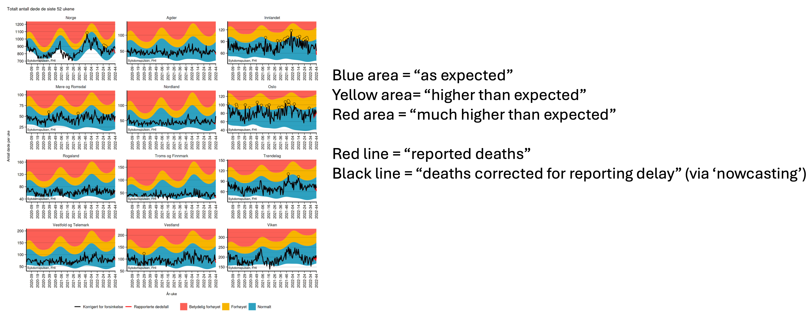
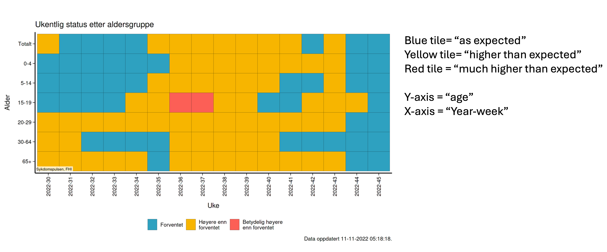
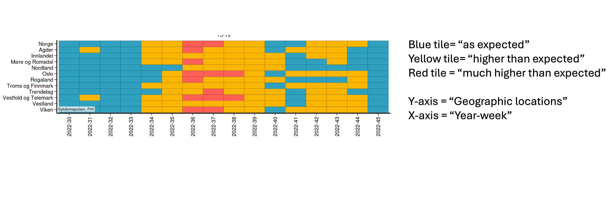
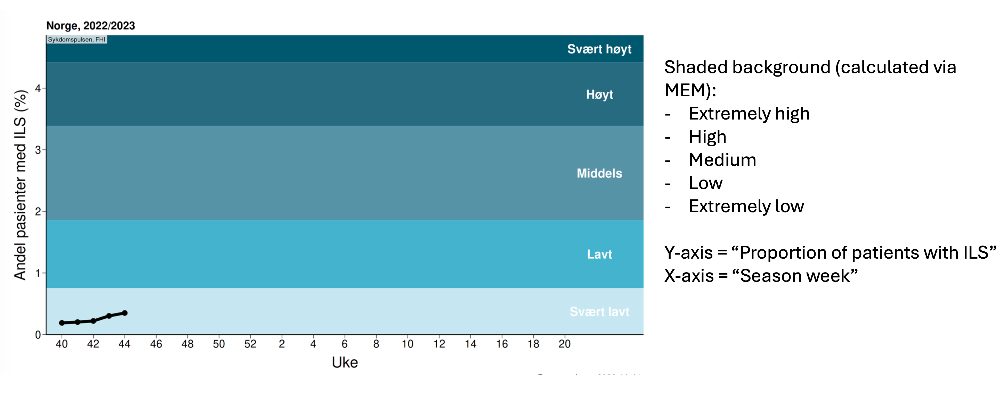
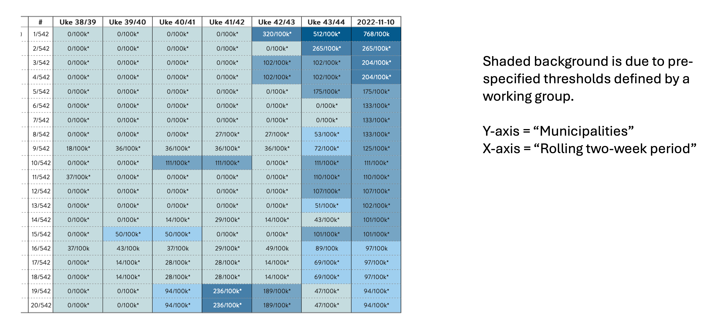

```{r, eval=F, echo=F, include = F}
# Must do in order to render.

pacman::p_load(xaringan)
devtools::install_github("gadenbuie/xaringanExtra")
devtools::install_github("gadenbuie/countdown")
remotes::install_github("mitchelloharawild/icons")
icons::download_fontawesome()

# Render with xaringan::infinite_moon_reader()
# Slides will appear in viewer, and will update as you edit/save
```


```{r setup, include=FALSE}
knitr::opts_chunk$set(echo = FALSE, 
                      warning = FALSE, 
                      message = FALSE, 
                      fig.retina = 3  ## retina more effective than w/h (according to twitter)
                      # fig.width = 16, 
                      # fig.height = 10
                      )
## I dont know why this is included in the example xaringan slide 
## but is something to do with background images
options(htmltools.dir.version = FALSE)

## install and load necessary packages 
pacman::p_load(
  rio,        # importing data  
  here,       # relative file pathways  
  janitor,    # data cleaning and tables
  lubridate,  # working with dates
  tidyverse,  # data management and visualization
  gtsummary,  # summary tables
  flair,      # coloring text
  kableExtra, # for output tables
  flextable,  # for some tables and styling
  xaringanthemer,  # for styling presentation 
  countdown
)

```


```{r  xaringan-themer, include = FALSE}

## define presentation colours (theme) using {xaringanthemer} package 
## https://pkg.garrickadenbuie.com/xaringanthemer/articles/xaringanthemer.html

## epirhandbook logo colours: 
  ## blue: "#00538c"
  ## green: "#007732"
  ## lighter green: "#48a878"

## see ?style_mono_accent for all the things can customise
style_mono_accent(
  base_color = "#00538c", 
  link_color = "#48a878", 
  # add logo to the title page (bit bigger)
  title_slide_background_image = "../../images/logo.png",
  title_slide_background_position = "95% 95%",
  title_slide_background_size = "25%",
  ## add logo to all following slides
  background_image = "../../images/logo.png", 
  background_size = "10%",
  background_position = "100% 0%"
)
```

```{css, echo=F}
    .remark-slide table{
      border: none
    }
    .remark-slide-table {
      
    }
    tr:first-child {
      border-top: none;
  }
    tr:last-child {
    border-bottom: none;
  }
  
.center2 {
  margin: 0;
  position: absolute;
  top: 50%;
  left: 50%;
}
```


```{css, echo = F}
/* THIS IS A CSS CHUNK - THIS IS A COMMENT */
/* Size of font in code echo. E.g. 10px or 50% */
.remark-code {
  font-size: 70%;
}
/* Size of font in text */
.medium-text {
  font-size: 75%;     
}
/* Size of font in tables */
.small-table table {
  font-size: 6px;     
}
.medium-table table {
  font-size: 8px;     
}
.medium-large-table table {
  font-size: 10px;     
}
```

# Pneumonia (with historical data)

```{r, eval = TRUE, echo = FALSE}
# Using here() alone won't work because Rmd folder becomes the rendering root.
# adding xfun::relative_path() creates a dynamic file path between the Rmd location and the here() path. It dynamically creates the ../../etc filepath.


```

---

# COVID-19 (no historical data due to seasonality issues)

```{r, eval = TRUE, echo = FALSE}

```

---

# All-cause mortality surveillance

```{r, eval = TRUE, echo = FALSE}

```

---

# Respiratory signals

```{r, eval = TRUE, echo = FALSE}

```

---

# Respiratory signals

```{r, eval = TRUE, echo = FALSE}

```

---

# Influenza intensity thresholds (using MEM)

```{r, eval = TRUE, echo = FALSE}

```

---

# COVID-19 reported cases per 100k population

```{r, eval = TRUE, echo = FALSE}

```
